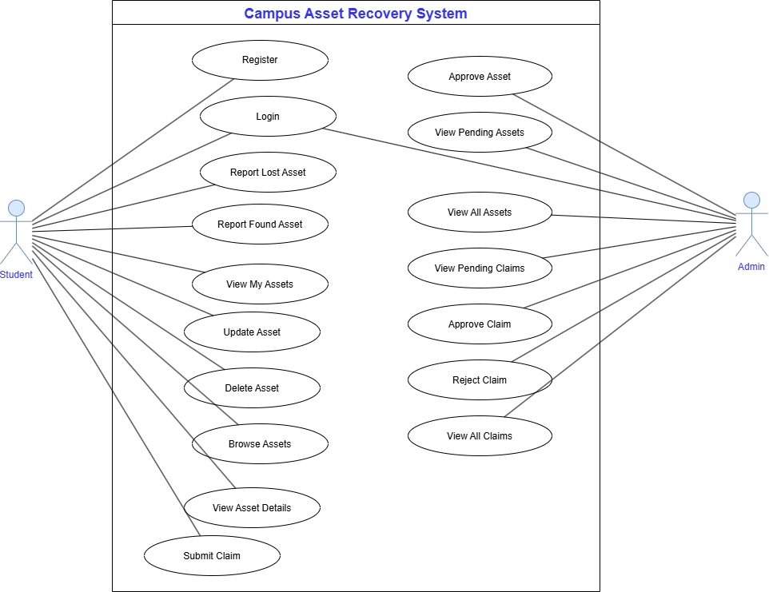

# Campus Asset Recovery System

A full-stack MERN application that helps students report lost and found items on campus. Students can report lost or found assets, browse approved reports, submit claims for found items, and track the status of their claims. Administrators can review asset reports, approve or reject claims, and manage the overall system.

---

## Use Case Diagram

The following use case diagram illustrates the interactions between the two primary actors in the system: **Student** and **Admin**.

  

---

## Student Features

- Register and Login
- Report Lost Assets
- Report Found Assets
- View and Manage Reported Assets
- Browse Approved Assets
- View Asset Details
- Submit Claims for Found Assets
- View and Cancel Pending Claims

---

## Admin Features

- Login
- View Pending Asset Reports
- Approve Asset Reports
- View All Assets
- View Pending Claims
- Approve or Reject Claims
- View All Claims

---